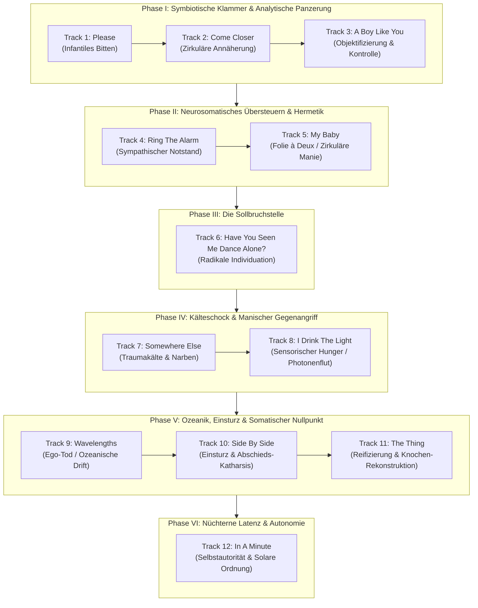

# Phase 2 (Makro-Ebene): Die Systemarchitektur des Albums
## Dokument 01: Der narrative Bogen — Chronologie der Entropie, des Zusammenbruchs und der somatischen Reorganisation

---

### Einleitung & Makro-Perspektive

Das vorliegende 12-Track-Werk ist kein loses Aggregat melodischer Momentaufnahmen, sondern eine streng determinierte kybernetische Systemabfolge. Es dokumentiert die Bewegung einer menschlichen Psyche durch die Phasen der symbiotischen Selbstaufgabe, des akuten neurosomatischen Alarms, des existenziellen Bruchs, des dissoziativen Schocks, der manischen Gegenregulation, des vollkommenen Ego-Todes bis hin zur anatomischen Neuformierung aus der Knochensubstanz.

Die Makro-Architektur lässt sich in sechs klar abgegrenzte Entwicklungsphasen unterteilen:

---

### Die 6 Entwicklungsphasen im Detail

#### Phase I: Symbiotische Klammerhaltung & Kognitive Gegenwehr (Tracks 1–3)
* **Dynamik:** Die Reise beginnt im Zustand der Selbstentleerung (*„Please“*). Die Psyche erlebt die Distanz zum Objekt als unerträgliches Vakuum und setzt in *„Come Closer“* eine zentripetale Sogwirkung in Gang. Da jedoch ungeschützte Nähe fundamentale Todesängste vor dem Verschlungenwerden auslöst, schlägt das System in *„A Boy Like You“* schlagartig in eine analytische Schutzpanzerung um: Das Objekt wird anatomisch seziert (*„blood, water, mud“*), typologisiert (*„a boy like you“*) und durch kognitive Durchleuchtung (*„I've seen your dreams“*) unschädlich gemacht. Es ist der vergebliche Versuch, Intimität ohne Verwundbarkeit zu erzwingen.

#### Phase II: Neurosomatisches Übersteuern & Hermetische Echokammer (Tracks 4–5)
* **Dynamik:** Der Widerspruch zwischen Verschmelzungswunsch und Kontrollzwang führt zur Überhitzung der Amygdala. In *„Ring The Alarm“* brennt das sympathische Nervensystem durch; der Notstand wird zur permanenten Klangkulisse, unterbrochen von dissoziativer Glossolalie (*„La la la tey oh“*). Um den drohenden Kollaps abzufangen, flieht die Psyche in *„My Baby“* in eine regressive Wahnkonstruktion: Die zirkuläre Behauptung absoluter exklusiver Fürsorge (*„Only me and my baby knows“*) errichtet eine sektenartige Zweier-Hermetik, die jede Außenrealität aussperrt.

#### Phase III: Die fatale Sollbruchstelle der Individuation (Track 6)
* **Dynamik:** In *„Have You Seen Me Dance Alone?“* bricht die Wahrheit wie ein tektonisches Beben in das System ein. Das Subjekt entdeckt seine Fähigkeit zur solitären Ekstase. Doch dieser Akt radikaler Autonomie ist in einem symbiotischen Gefüge nicht integrierbar: Er zersprengt den gemeinsamen Mythos. Der Tanz des Alleinseins ist der ultimative Verrat am symbiotischen Pakt. Die Beziehung bricht in diesem Moment unwiderruflich zusammen.

#### Phase IV: Post-traumatischer Kälteschock & Manischer Gegenangriff (Tracks 7–8)
* **Dynamik:** Die unmittelbare Konsequenz der Trennung ist die eisige Ödnis in *„Somewhere Else“*. Die Kälte wird somatisiert (*„It's cold out here“*), das Trauma im eigenen Fleisch verewigt (*„Carved on my body“*). Um nicht an der einsetzenden emotionalen Nekrose zu ersticken, startet das System in *„I Drink The Light“* einen gewaltigen manischen Gegenangriff: Die Taubheit soll durch den radikalen Konsum extremer Reize – das Trinken von Licht und das Schlucken der Sonne – verbrannt werden. Es ist der Kampf auf Leben und Tod gegen die innere Nulllinie.

#### Phase V: Ozeanische Auflösung, Katharsis & Der somatische Nullpunkt (Tracks 9–11)
* **Dynamik:** Die manische Flutwelle bricht zusammen und spült das Subjekt in *„Wavelengths“* an den Strand des Ego-Todes (*„Who am I?“*). Sämtliche Identitätsstrukturen lösen sich auf. In *„Side By Side“* vollzieht das Subjekt die reale Trauerarbeit: Vor den Füßen des Anderen zerbröckelnd (*„And I crumble“*), erkennt es, dass die Tränen der Abschied waren. In *„The Thing“* erreicht die Psyche schließlich den absoluten Nullpunkt: Gefühle werden zu toten, sezierbaren Objekten reifiziert (*„What are feelings? Are they real things?“*). Anstatt jedoch zu resignieren, beginnt der Wiederaufbau am härtesten Fundament: dem Skelett (*„I'll build my body from the bone“*).

#### Phase VI: Disziplinierte Rückkehr & Solare Souveränität (Track 12)
* **Dynamik:** In *„In A Minute“* kehrt das Subjekt ins Leben zurück – nicht als naiver Träumer, sondern als gestählter, autonomer Geist. Das Leitmotiv *„Don't you forget about yourself“* fungiert als unzerstörbare Grenzmarke. Die Genesung wird nicht erzwungen, sondern in nüchterner Latenz abgewartet (*„In a minute, I would see the sun“*). Das Werk schließt mit der Wiederherstellung der inneren Souveränität.
