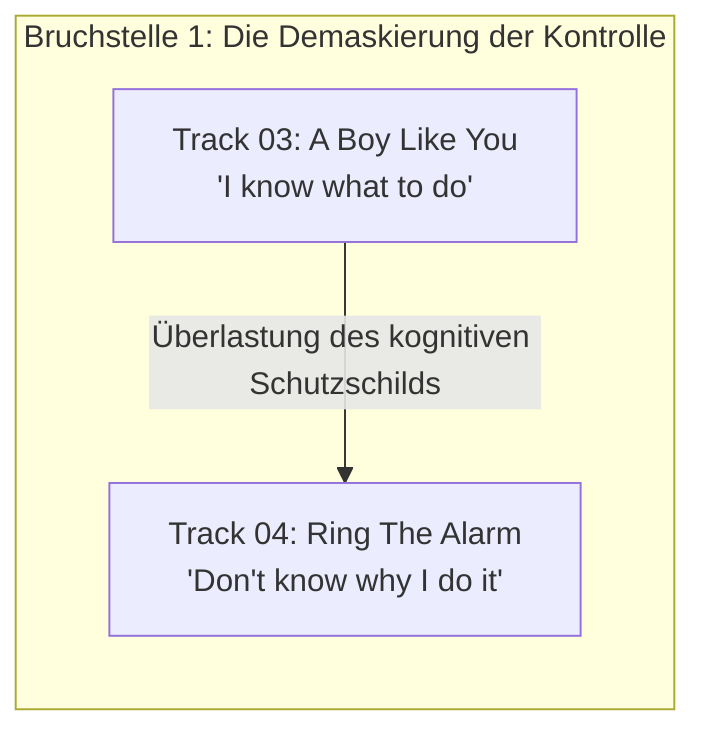
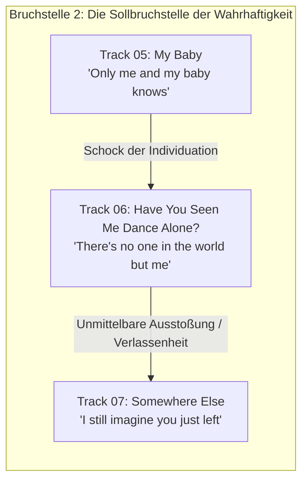
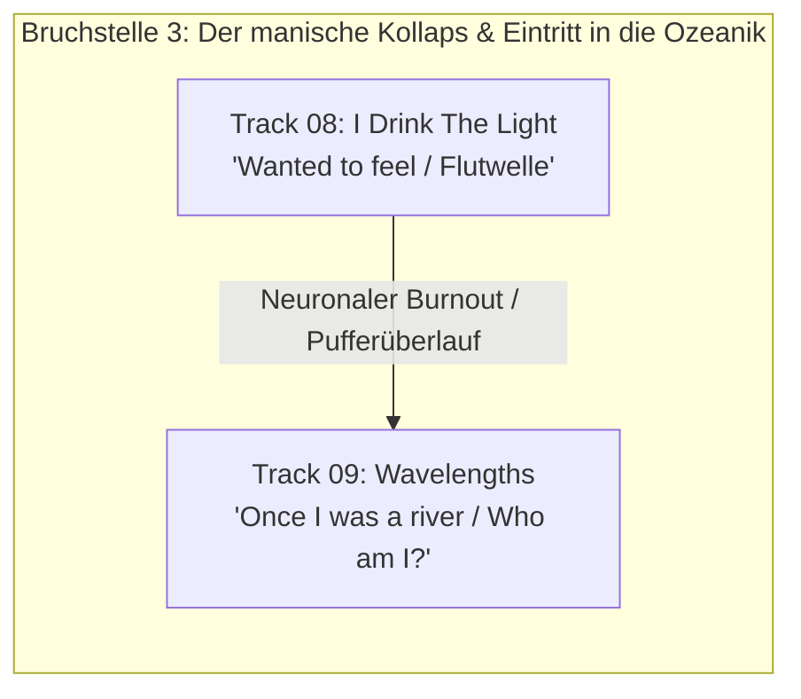
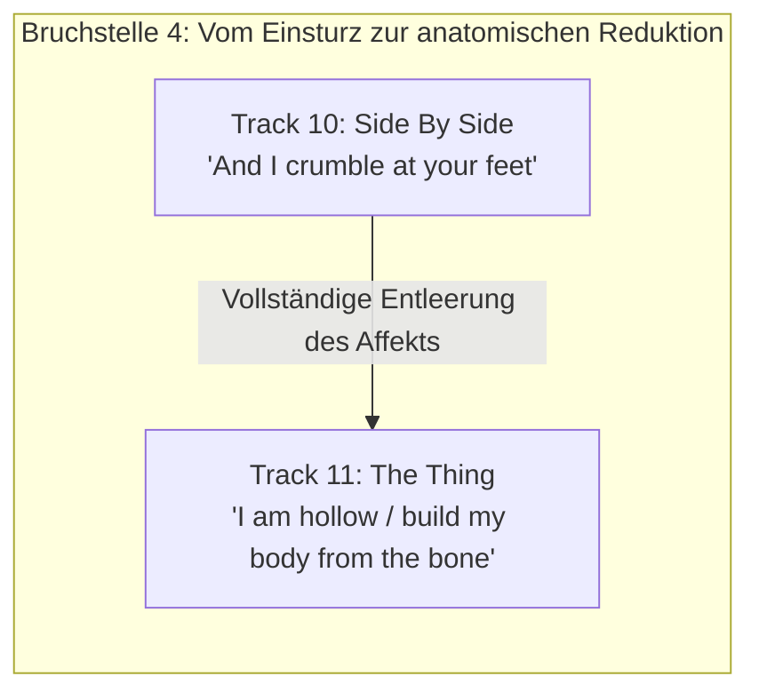

# Phase 2 (Makro-Ebene): Die Systemarchitektur des Albums
## Dokument 02: Systemische Bruchstellen — Die impliziten Katastrophen in den Fugen zwischen den Tracks

---

### Die unsichtbaren Ereignishorizonte

Ein entscheidendes Merkmal dieses Albums ist, dass die folgenschwersten seelischen Katastrophen nicht innerhalb der Texte explizit auserzählt werden, sondern sich in den unsichtbaren Zwischenräumen – den Fugen und Brüchen zwischen den Tracks – ereignen. Hier vollziehen sich die nicht verhandelbaren Phasenübergänge des Systems.

---

### Analyse der kritischen Nahtstellen

* **Was zwischen Track 3 und 4 geschieht:**
  In Track 3 behauptete das Subjekt die absolute kognitive und libidinöse Kontrolle (*„I know you / You don't know me“*). Doch diese Haltung ist instabil: Wer ein Gegenüber permanent analysieren muss, um sich sicher zu fühlen, investiert seine gesamte psychische Energie in die Abwehr. Zwischen Track 3 und 4 bricht das kognitive System unter der Last seiner eigenen Hypervigilanz zusammen. Die Schutzbehauptung der Allmacht zerschellt an der Realität der eigenen Triebgebundenheit. Das Ergebnis ist das unkontrollierte Feuern des vegetativen Alarmsystems in Track 4.

---

* **Was zwischen Track 5, 6 und 7 geschieht (Das Epizentrum der Tragödie):**
  * **Zwischen 5 und 6:** In Track 5 rotierte das Subjekt im hermetischen Wahn der exklusiven Zweisamkeit. In der Fuge zu Track 6 geschieht ein plötzlicher, luzider Moment: Das Subjekt blickt auf sich selbst und erkennt die Gefängnisstruktur des Karussells. Es tritt heraus und beginnt, für sich allein zu tanzen.
  * **Zwischen 6 und 7:** Dies ist die dramatischste Bruchstelle des gesamten Werks. Der Moment radikaler Wahrhaftigkeit und Autonomie in Track 6 (*„Have you seen me dance alone?“*) wird vom dysfunktionalen System nicht toleriert. In dem Moment, in dem das Subjekt demonstriert, dass es autark existieren kann, bricht die symbiotische Bindung schlagartig ab. Zwischen Track 6 und 7 erfolgt der Kontaktabbruch, das Verlassenwerden, der Kaltentzug. Track 7 beginnt bereits in der post-traumatischen Trümmerlandschaft (*„I still imagine you just left / Somewhere else“*). Die Ehrlichkeit wurde mit existenzieller Verstoßung bestraft.

---

* **Was zwischen Track 8 und 9 geschieht:**
  Track 8 endete in einer stotternden, maschinengewehrartigen Kaskade von *-ted to feel*-Fragmenten – dem akuten Pufferüberlauf des Nervensystems bei maximaler Reizüberflutung. Zwischen Track 8 und 9 schlägt die manische Hyperthermie in die hypotherme Depersonalisation um. Das Gehirn schaltet die corticalen Zentren ab; das Subjekt fällt aus der Zeit und landet im zeitlosen Raum der Gehirnwellen (*„Wavelengths of my mind“*). Es ist der Übergang von der Hyperaktivität in den dissoziativen Stupor.

---

* **Was zwischen Track 10 und 11 geschieht:**
  In Track 10 vollzieht das Subjekt den physischen Kollaps (*„And I crumble at your feet / It's the way to say goodbye“*). Sämtliche Tränen fließen ab; die alte Identität zerbricht endgültig. Zwischen Track 10 und 11 kühlt die glühende Lava des Schmerzes zu totem Basalt ab. Track 11 beginnt nicht mit Weinen, sondern mit dem kühlen, sezierenden Blick auf den Schrottplatz der eigenen Emotionen: *„What are feelings? Are they real things?“*. Hier entsteht aus den Trümmern des Nervenzusammenbruchs die unerbittliche Entscheidung zur osteologischen Selbst-Konstruktion.
