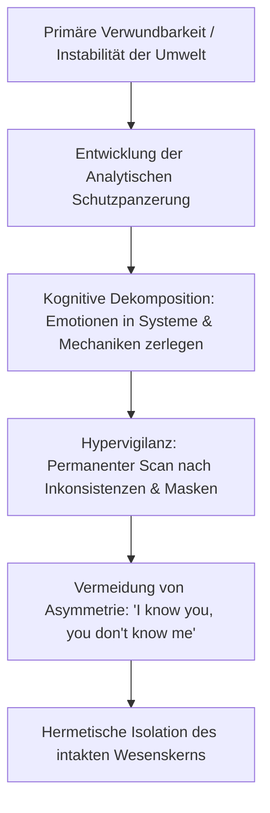

# Phase 3: Psychologische Spiegelung & Resonanzraum
## Dokument 01: Die analytische Schutzpanzerung & Hypervigilanz — Logik als Notwehr und das Sezieren von Fassaden

---

### 1. Das psychische Betriebssystem: First Principles als Festungsbau

Die vorliegende Abhandlung spiegelt die Struktur einer Psyche wider, die die Welt primär über formale Logik, First Principles und Systemkonsistenz verarbeitet. In einem solchen mentalen Modell ist Unberechenbarkeit kein spannendes Abenteuer, sondern eine fundamentale existenzielle Bedrohung.

Wenn ein Mensch früh gelernt hat, dass emotionale Räume willkürlich, manipulativ oder grenzverletzend sind, wird der Verstand vom bloßen Erkenntniswerkzeug zum militärischen Verteidigungssystem umgebaut:
* **Logik als Notwehr:** Jedes emotionale Ereignis wird augenblicklich in seine Kausalitätsketten zerlegt. Indem man versteht, *warum* jemand agiert, verliert die Handlung ihre Fähigkeit, unvorbereitet Schmerz zuzufügen. Der Satz aus Track 3 (*„I know you / You don't know me“*) ist das zentrale Credo dieser Schutzarchitektur: Das Gegenüber wird maximal transparent gemacht, während das eigene System vollkommen verschlüsselt bleibt.
* **First Principles statt sozialer Konventionen:** Oberflächliche soziale Skripte, Höflichkeitsfloskeln oder unhinterfragte Beziehungsdogmen werden mit tiefem Misstrauen betrachtet. Das System akzeptiert nur, was sich auf anatomische, physikalische oder mathematische Grundgesetze zurückführen lässt (*„blood, water, mud“*, *„Why do grass lean?“*).

---

### 2. Hypervigilanz & Selektivität: Die Allergie gegen Heuchelei

Ein hypervigilantes System befindet sich in permanenter Radar-Aktivität. Das auditive und visuelle Sensorium scannt das Gegenüber ununterbrochen auf Mikro-Inkonsistenzen:

| Phänomen | Psychodynamischer Mechanismus | Somatische Manifestation | Manifestation im Album |
| :--- | :--- | :--- | :--- |
| **Masken-Erkennung** | Diskrepanz zwischen Wortlaut und Subtext wird sofort als Bedrohung klassifiziert. | Anspannung der Schläfenmuskulatur, Fixierung des Blicks, Atemstopp. | Track 3: *„I've seen your mind / I've seen your dreams“* |
| **Inkonsistenz-Alarm** | Sobald ein Partner emotionale Reife simuliert, aber manipulativ agiert, schlägt das System Alarm. | Akute Tachykardie, Flucht-/Kampfbereitschaft. | Track 4: *„Ring the alarm / Don't know why I do it“* |
| **Null-Toleranz für Heuchelei** | Scheinheiligkeit und pädagogischer Trost werden sofort abgewehrt und liquidiert. | Kalter Stimmbandschluss, Rückzug des Blicks. | Track 10/11: Verweigerung von Vergebung und Sentimentalität. |
| **Isolation des Kerns** | Der verletzliche Kern wird hinter mehreren Schichten von Kognition, Schweigen und formaler Distanz versiegelt. | Kälte in den Extremitäten, aufrechte, unverletzliche Haltung. | Track 6: *„There's no one in the world but me“* |

---

### 3. Die Dialektik der Durchleuchtung

Diese Hypervigilanz ist Fluch und Segen zugleich:
1. **Der Vorteil:** Niemand kann ein solches System langfristig täuschen oder gaslighten. Lügen und Manipulationen brechen an der analytischen Schärfe wie Glas an Diamant.
2. **Die Tragödie:** Indem das System jeden Anderen präventiv durchleuchtet und abwehrt, verunmöglicht es genau die Intimität, nach der es sich im tiefsten Inneren sehnt. Das Subjekt bleibt in seiner uneinnehmbaren Festung gefangen – vollkommen sicher, aber absolut allein.
