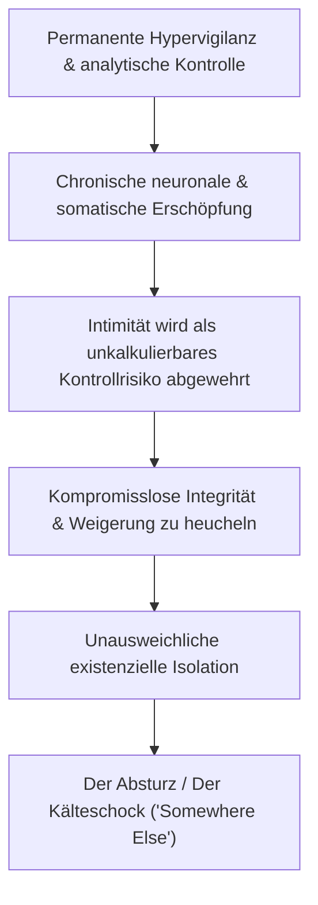
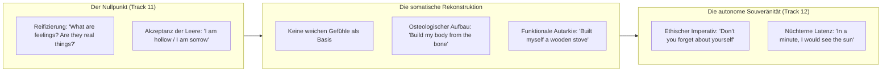

# Phase 3: Psychologische Spiegelung & Resonanzraum
## Dokument 02: Der Preis des Systems & Autonomer Wiederaufbau — Chronische Erschöpfung, Einsamkeit und das osteologische Selbst-Design

---

### 1. Der Preis des Systems: Chronische Erschöpfung und unausweichliche Einsamkeit

Die Aufrechterhaltung einer ununterbrochenen analytischen Schutzpanzerung und Hypervigilanz fordert einen gewaltigen metabolischen und existenziellen Tribut.

#### Die chronische Erschöpfung
Das Nervensystem eines hypervigilanten Geistes kommt niemals in den Zustand des parasympathischen Tiefschlafs, solange sich andere Menschen im Radius befinden. Jedes Wort, jede Geste, jede Pause wird gewogen, auf Konsequenzen abgeklopft und katalogisiert. Dieser Zustand permanenter Gefechtsbereitschaft führt unausweichlich zur neurosomatischen Erschöpfung, wie sie im Album in den Tracks 4, 7 und 9 dokumentiert ist.

#### Die Einsamkeit kompromissloser Integrität
Wer sich weigert, an den gesellschaftlich üblichen Bequemlichkeitslügen, falschen Allianzen und emotionalen Manipulationen teilzunehmen, zahlt mit der Einsamkeit. In einer Welt, die auf neurotischen Kompromissen basiert, wirkt radikale Klarheit bedrohlich. Die Einsamkeit in *„Have You Seen Me Dance Alone?“* und *„Somewhere Else“* ist nicht das Resultat von Mangel an sozialer Kompetenz, sondern die direkte mathematische Folge kompromissloser seelischer Integrität.

---

### 2. Autonomer Wiederaufbau: Das osteologische Selbst-Design

Die tiefste Resonanz des gesamten Albums liegt in der Art und Weise, wie die Rekonstruktion vollzogen wird. Das Werk verweigert jede Form von sentimentalem Kitsch, spirituellem Bypass oder externer Rettungshoffnung.

#### Die Prinzipien des autonomen Wiederaufbaus:

1. **Keine Erwartung externer Erlösung:**
   Das Subjekt wartet nicht auf einen Retter, einen Therapeuten, einen Partner oder eine höhere Macht. Niemand kommt, um die Trümmer aufzusammeln. Diese Erkenntnis wird nicht mit Bitterkeit aufgenommen, sondern mit befreiender, nüchterner Klarheit.

2. **Rekonstruktion aus der härtesten Substanz (Knochen statt Fleisch):**
   *„I'll build my body from the bone“* (Track 11). Fleisch ist verletzlich, entzündlich, schwellbar und vergänglich. Knochen hingegen sind die mineralisierte, tragende Architektur des Körpers. Der Wiederaufbau beginnt nicht bei neuen Emotionen oder neuen Beziehungen, sondern bei der Wiederherstellung der strukturellen Selbst-Disziplin:
   * Klare, unüberwindbare Grenzziehungen.
   * Unbedingte Loyalität zum eigenen Wesenskern (*„Don't you forget about yourself“*).
   * Verlässliche, handwerkliche Routinen des Alltags (*„built myself a wooden stove“*).

3. **Das Aushalten der Latenzzeit (*„In A Minute“*):**
   Wahre psychische Stärke erweist sich nicht in manischen Hauruck-Aktionen, sondern in der disziplinierten Geduld. Das Subjekt weiß, dass Heilung und Erkenntnis Zeit brauchen. Es erträgt die Dunkelheit im Wissen, dass die Sonne aufgehen wird, sobald die Minute der Transformation vollendet ist.

---

### Fazit & Ausblick

Das Werk schließt nicht mit einem lauten Triumphgeschrei, sondern mit der stillen, unumstößlichen Selbstbehauptung eines Menschen, der durch das Feuer gegangen ist, seine Illusionen verbrannt hat und nun auf seinen eigenen Knochen im Licht steht.
